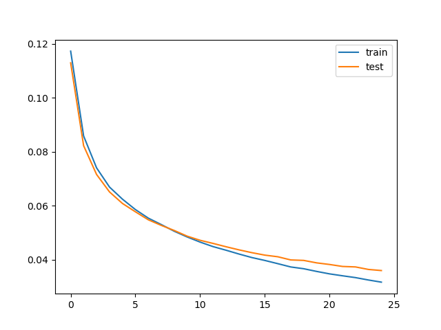
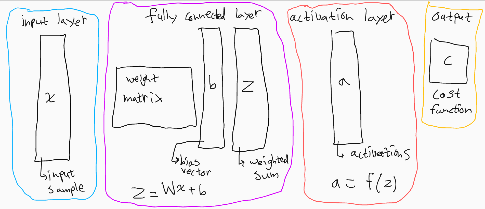
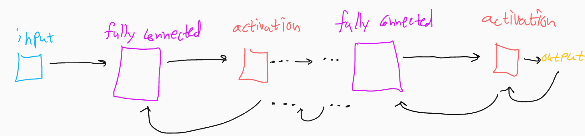
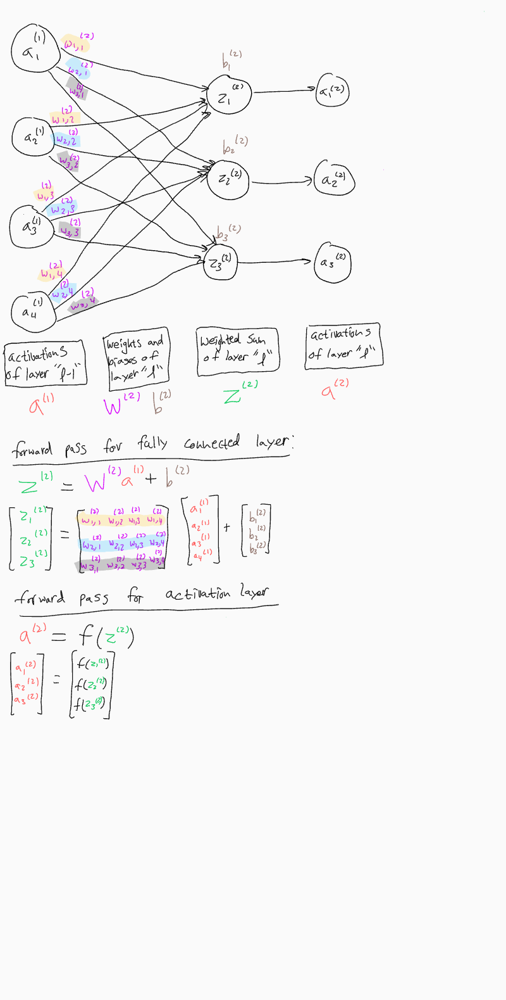
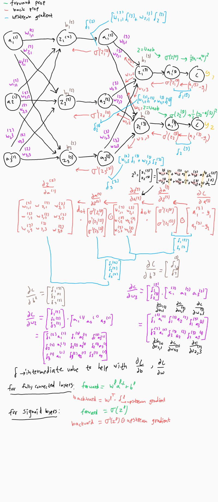

*resuming work on this*

# Simple Neural Network from Scratch  

This project is a set of python classes for building simple neural networks from scratch (i.e. using only NumPy and not frameworks such as PyTorch or TensorFlow). The purpose of this project was to get a better understanding of backpropagation by implementing it from scratch. Some of the code, ideas, and inspiration are taken from other sources which is explained and cited in the comments of *src/NeuralNet.py*. There are no convolution layers or regularization methods currently (only fully connected feedforward networks). One of the example networks is able to classify 9728/10000 images in the MNIST test set.

# Future Goals
I am not currently working on this project but in the future I hope to add more functionality and implement these deep learning methods from scratch:
* Add functionality for regularization techniques (L2, dropout, etc.) and batch normalization
* Add functionality for convolution layers (implement forwards and backwards pass functions)
* Add functionality for RNN layers (forward pass and back propagation through time)
* Implement an automatic differentiation tool

# Sections  

[Project Structure](#project-structure)   
[Usage](#usage)  
[Examples](#examples)  
[Structuring Datasets](#structuring-datasets)  
[Visualization](#visualization)  

# Project Structure  

The project is split up into the following directories:  
**datasets**  
* contains MNIST dataset and some test images of my own handwriting  
* see [Structuring Datasets](#structuring-datasets) for how to add more data

**plots**  
* plots of cost vs. epochs stored here  

**pre-trained**  
* pre-trained networks stored as .pickle files  
* see [Usage](#usage) for how to save/load networks
  
**src**  
* source code where networks can be built, trained, tested  

# Usage  
### Setup
1. Clone the repo:  ```git clone https://github.com/geffencooper/nn_from_scratch.git```  
2. Install libraries: ```pip3 install [library]```
   * numpy
   * matplotlib (for plots)
   * python-mnist (for extracting MNIST data)
   * scikit-learn (for creating datasets)
   * Pillow (for plots)
   * pickle-mixin (for saving networks)
   * pandas (for datasets)
3. go to the src directory:  ```cd src```

### Building, Training, Testing
1. Create a *Network* object:  
```ruby
net = Network(input_layer_size, cost_function, cost_function_derivative)
```
2. Add layers to the network:  
```ruby
net.add_fc_layer(layer_size)
net.add_sigmoid_layer(layer_size)
net.add_fc_layer(layer_size)
net.add_sigmoid_layer(layer_size)
...
```
3. Train the network:
```ruby
net.stochastic_gradient_descent(training_data, number_of_epochs, batch_size, learning_rate, testing_data)
```
```
console output:
Epoch 0: Test_data: 8902/10000 Train Cost=0.11722658281111872 Test Cost=0.1128977384523250
Epoch 1: Test_data: 9085/10000 Train Cost=0.08583412961550049 Test Cost=0.0822464164454141
Epoch 2: Test_data: 9177/10000 Train Cost=0.07403771585455693 Test Cost=0.07159634300435123
Epoch 3: Test_data: 9240/10000 Train Cost=0.06692385932641985 Test Cost=0.06512600340515386
Epoch 4: Test_data: 9280/10000 Train Cost=0.06244376169346048 Test Cost=0.06085638122703422
Epoch 5: Test_data: 9326/10000 Train Cost=0.05859600076480681 Test Cost=0.05776851656578591
Epoch 6: Test_data: 9352/10000 Train Cost=0.05541301406636375 Test Cost=0.05480281592166194
Epoch 7: Test_data: 9381/10000 Train Cost=0.05303608169350595 Test Cost=0.05272980943624705
Epoch 8: Test_data: 9409/10000 Train Cost=0.05056847729172933 Test Cost=0.05085431989952933
Epoch 9: Test_data: 9442/10000 Train Cost=0.048446194215249254 Test Cost=0.0487468057231946
Epoch 10: Test_data: 9456/10000 Train Cost=0.046551491569778836 Test Cost=0.047216540074613
Epoch 11: Test_data: 9460/10000 Train Cost=0.04487991727697655 Test Cost=0.0460620296826043
Epoch 12: Test_data: 9475/10000 Train Cost=0.043547284544788734 Test Cost=0.044833723503173
Epoch 13: Test_data: 9501/10000 Train Cost=0.042135601036447 Test Cost=0.04368067406405916
Epoch 14: Test_data: 9504/10000 Train Cost=0.04082620489346034 Test Cost=0.0426357985844561
Epoch 15: Test_data: 9523/10000 Train Cost=0.03975689189723435 Test Cost=0.0417279375596736
Epoch 16: Test_data: 9535/10000 Train Cost=0.03856879162253755 Test Cost=0.0411223441852271
Epoch 17: Test_data: 9536/10000 Train Cost=0.03734762009159344 Test Cost=0.0399475591335632
Epoch 18: Test_data: 9539/10000 Train Cost=0.03669356713890372 Test Cost=0.0397739726891945
Epoch 19: Test_data: 9554/10000 Train Cost=0.03569755734560578 Test Cost=0.0388635666367369
Epoch 20: Test_data: 9560/10000 Train Cost=0.03478683579846275 Test Cost=0.0382654866198232
Epoch 21: Test_data: 9568/10000 Train Cost=0.03408051217924574 Test Cost=0.0375377081324646
Epoch 22: Test_data: 9578/10000 Train Cost=0.03340794070944498 Test Cost=0.0373592999928893
Epoch 23: Test_data: 9579/10000 Train Cost=0.03252002049347548 Test Cost=0.0364276684765355
Epoch 24: Test_data: 9583/10000 Train Cost=0.0317251449919646 Test Cost=0.03601985280092705
```
  
4. Store the network to a file:
```ruby
file_handle = open("file_name.pickle", "wb") # open a file
pickle.dump(net, file_handle) # store Network object to a file
file_handle.close() # close the file
```
5. Test the network on an image
```ruby
img = Image.open("../datasets/images/img.png").convert('L') # load an image, convert to grayscale
img = np.asarray(img).astype(np.float32)/255.0 # convert image to numpy array and normalize
img = img.reshape(784,1) # convert array to column vector

file_handle = open("../pre-trained/network1.pickle", "rb") # open the file of the Network object
net = pickle.load(file_handle) # load the object
file_handle.close() # close the file

print("Result ....", np.argmax(net.forward_pass(img))) # pass the image through the network
```
# Examples
### Example 1: training and testing on MNIST dataset
1. Train on MNIST, *can also call train_mnist() inside of build_network.py*
```ruby
training_data, testing_data = get_mnist() # get the training and testing data

# create a network
net = Network(784, cross_entropy_cost, cross_entropy_cost_prime_SM)
net.add_fc_layer(50)
net.add_relu_layer(50)
net.add_fc_layer(10)
net.add_relu_layer(10)
net.add_softmax_layer(10)

# train the network
net.stochastic_gradient_descent(training_data,20,32,0.04,testing_data)

# store the network to a file
file_store = open("../pre-trained/_50_hidden_20_epochs_CE2.pickle", "wb")
pickle.dump(net, file_store)
file_store.close()
```

```
console output:  
Epoch 0: Test_data: 9254 / 10000 Train Cost =  0.2598732152181026 Test Cost =  0.258077597107767  
Epoch 1: Test_data: 9418 / 10000 Train Cost =  0.19378135333333085 Test Cost =  0.2000486292528665  
Epoch 2: Test_data: 9547 / 10000 Train Cost =  0.14620308926256503 Test Cost =  0.1571220185445186  
Epoch 3: Test_data: 9609 / 10000 Train Cost =  0.12160463877460954 Test Cost =  0.1365775716356947  
Epoch 4: Test_data: 9627 / 10000 Train Cost =  0.10876644848106415 Test Cost =  0.1244021396833792  
Epoch 5: Test_data: 9661 / 10000 Train Cost =  0.09708848893673981 Test Cost =  0.1136791221322680  
Epoch 7: Test_data: 9676 / 10000 Train Cost =  0.08014775486035781 Test Cost =  0.1072875059952299  
Epoch 8: Test_data: 9684 / 10000 Train Cost =  0.07081856319168572 Test Cost =  0.1007006427819649  
Epoch 9: Test_data: 9671 / 10000 Train Cost =  0.06798449645739901 Test Cost =  0.1014454039079973  
Epoch 10: Test_data: 9706 / 10000 Train Cost =  0.06154090155882134 Test Cost =  0.097396495176051  
Epoch 11: Test_data: 9718 / 10000 Train Cost =  0.05879095415597285 Test Cost =  0.093961334922342  
Epoch 12: Test_data: 9687 / 10000 Train Cost =  0.05697602690477164 Test Cost =  0.100156864652717  
Epoch 13: Test_data: 9720 / 10000 Train Cost =  0.05155921362014973 Test Cost =  0.092171592768846  
Epoch 14: Test_data: 9721 / 10000 Train Cost =  0.050302142623740116 Test Cost =  0.09432746391280  
Epoch 15: Test_data: 9711 / 10000 Train Cost =  0.044366312824647224 Test Cost =  0.09064842284499  
Epoch 16: Test_data: 9726 / 10000 Train Cost =  0.043713930603209286 Test Cost =  0.09186506621935  
Epoch 17: Test_data: 9724 / 10000 Train Cost =  0.03886184427803502 Test Cost =  0.090812193451396  
Epoch 18: Test_data: 9729 / 10000 Train Cost =  0.03554698541988986 Test Cost =  0.087452084936556  
Epoch 19: Test_data: 9728 / 10000 Train Cost =  0.03497675159863277 Test Cost =  0.090327809761121  
```

Test on an image of a digit (created by hand in microsoft paint, 28x28 px)
```ruby
digit = Image.open("../datasets/my_handwriting/9.png").convert('L')
digit = np.asarray(digit).astype(np.float32)/255.0
digit = digit.reshape(784,1)

file_store = open("../pre-trained/net_50_hidden_30_epochs.pickle", "rb")
net = pickle.load(file_store)
file_store.close()

print("It is a ....", np.argmax(net.forward_pass(digit)))
```

 

```
It is a .... 8
```

### Example 2: train on artificial cluster data from scikit-learn  
This example can be found in *build_network.py*
```ruby
# build the network layer by layer
net = Network(2, quadratic_cost, quadratic_cost_prime)
net.add_fc_layer(4)
net.add_sigmoid_layer(4)
net.add_fc_layer(3)
net.add_sigmoid_layer(3)

# generate the data
training_data, test_data, choices = gen_clusters()

# train the network
net.stochastic_gradient_descent(training_data,30,50,0.9,test_data)

# test the network by typing in a coordinate (can view from plot displayed)
# normalize the input data by dividing by 500

# input 1
x_in = float(input("x:"))/500
y_in = float(input("y:"))/500
coord = np.array([[x_in,y_in]]).transpose()
print(choices[np.argmax(net.forward_pass(coord))])

# input 2
x_in = float(input("x:"))/500
y_in = float(input("y:"))/500
coord = np.array([[x_in,y_in]]).transpose()
print(choices[np.argmax(net.forward_pass(coord))])

# input 3
x_in = float(input("x:"))/500
y_in = float(input("y:"))/500
coord = np.array([[x_in,y_in]]).transpose()
print(choices[np.argmax(net.forward_pass(coord))])
```

# Structuring Datasets
Training and test data are passed to the network as a list of tuples:

[ (input_data_1, output_label_1), (input_data_2, output_label_2), ... ]  

The shape of the input data is a column vector (nx1 numpy array)
The output data is a one-hot column vector
### Example
```ruby
dataset = []
input = np.zeros((5,1)) # create a 5x1 column vector
label = np.array([[0,0,1,0]]).transpose() # create a one-hot 4x1 column vector
dataset.append((input, label))
```
**See** *make_data.py* **for in more complex examples of how to create a dataset**


# Visualization
The classes in *NeuralNet.py* are created in a way that makes it easy to build and  
train small feed-forward networks for simple classification tasks and experimenting
with different hyperparameters.

### High Level Structure 
In *NeuralNet.py* there layer classes which we can generalize as follows:
* **input layer:** dummy layer to feed data sample into the network
* **fully connected layer:** computes weighted sum of previous layer outputs
* **activation layer:** passes previous layer output through activation
* **output:** compares final layer output to the known label  
  

In general the fully connected layer and activation layer come as a pair where the weighted sum is passed to the activation layer on a forward pass and the upstream gradient multiplied element-wise by the local derivative of the activation gets passed back to the fully connected layer on a backwards pass.  
  

A detailed example of a forward and backward pass by hand for a sigmoid activation and MSE cost is shown:
### Forward Pass for fully connected layer and activation layer
* the notation below treats the fully connected layer and activation layer as a pair layer "l" 
* in the code, these two layers are independent objects but the assumption is that an activation will always come after a fully connected layer  
  

### Backward Pass for fully connected layer and sigmoid layer with MSE cost function  
* this diagram has a lot going on but the equations at the bottom describe the backward pass concisely
* for an activation layer, it multiplies the **upstream gradient** *elementwise* by the **local derivative of the activation function** evaluated at the **input** which is the **weighted sum** passed into it.
* for a fully connected layer, it does a *matrix multiplication* of the **weight matrix transpose** and the **upstream gradient** which is denoted by an intermediate value called *delta* in the diagram
* the reason we do this for a fully connected layer is because the derivative of the weighted sum with respect to the activation is the weights. However, the gradient will merge in the next layer back so the branches must be summed. So the weight matrix transpose multiplied by the upstream gradient accounts for the branching. This is understood more clearly when observing a single activation, such as a_1 in layer 2.
   
* now to get the partial derivatives of the weights we multiply the upstream gradient by the derivative of the weighted sum with respect to the weights, which is the activations. For the biases, we do the same thing but since the bias is multiplied by one, the derivative is 1.
* so dw_dc = upstream_grad times activations and db_dc = upstream_grad
* for the weights, this becomes an outer product so we get a matrix which is shown in purple
